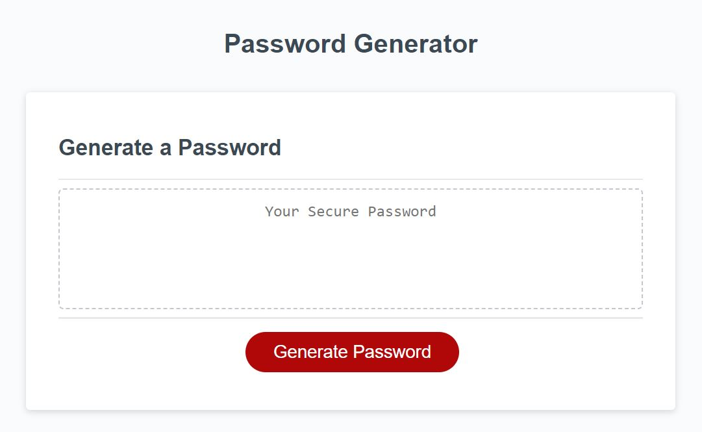

# Password Generator

## Description
- This is a random password generator i have created with javascript. It takes from the user criteria, such as password length, and defined character types. The specified criteria is then ran through a function and gives a randomized password.
## Details
- The password generator will cancel the function and let the user know if they have not entered a correct number for their character length. The user is then given options to include specific character type criteria. If no criteria is selected it returns the function untill at least one type is selected.

## What it solves
- The password generator solves a need for a secure password.  Many companies require employees to create a tempoary secure password every so often. This offers a means to create that password at the click of a button.

## What i learned
- I learned how to dynamically manipulate data based on user criteria provided by a series of prompts. The biggest 'aha!' moment i had was setting confirmed criteria prompts  to a new variable that was equal to all confirmed criteria arrays. If an array wasn't confirmed, there was no variable made thus not being included in the confirmed pool. I ran into many problems. The biggest problem i had was how to get the characters to equal the ammount needed. I found that looping through an array of combined user defined criteria grabbing random elements from it and pushing them to a new aray with the user defined length solved that problem.

## Deployment Link
https://kcavner.github.io/wk-2-challenge---Portfolio/

## License

